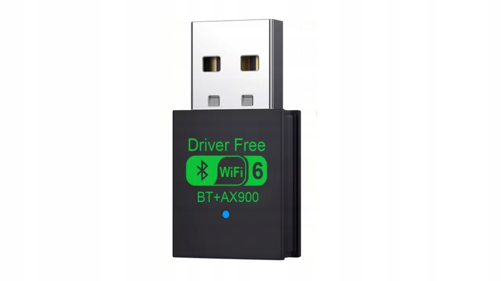
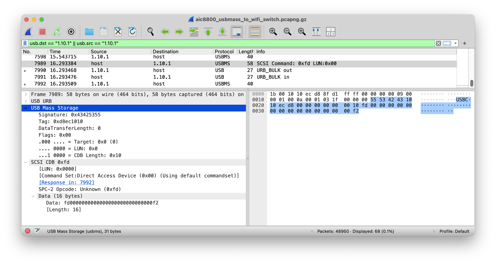

# ax900-bt
Getting $5 Wifi 6 + BT adapter working under Linux

# TLDR

Don't buy this device. If you already did and want to use it under Linux (for MiSTer), follow these instructions:

Prebuilt MiSTer drivers: [aic8800-5.15.1-MiSTer.tar.gz](aic8800-5.15.1-MiSTer.tar.gz)

1. Extract `drivers/` to `/lib/modules/5.15.1-MiSTer/kernel/drivers/` and `firmware/` to `/lib/firmware`
2. Run `depmod -a`
3. `echo 'ACTION=="add", SUBSYSTEM=="usb", ATTRS{idVendor}=="1111", ATTRS{idProduct}=="1111", RUN+="/usr/sbin/usb_modeswitch -v 1111 -p 1111 -M 555342431010ecd800000000000010fd0000000000000000000000000000f2"' > /etc/udev/rules.d/01-aic8800.rules`
4. `udevadm control --reload`

Plug the dongle and verify that the new network adapter appeared under `ip l`

# Information

The seller does not share which chipset the adapter uses.

It is sold under "WiFi 6 AX900 Bluetooth 5.4 WiFi USB Adapter Wireless Network Card 2.4G&5GHz Wi-Fi Antenna For PC Driver Free USB WiFi Receiver" branding

They claim compatibility with all Windows, macOS, and Linux.

When connected to a computer, it presents itself as a mass storage device:
```
/media/usb0# lsusb
Bus 001 Device 006: ID 1111:1111 Pandora International Ltd. 88M80
```

Contents of the drive:
```
/media/usb0# ls -la
total 2705
drwxr-xr-x  2 root root   16384 Jan  1  1970 .
drwxr-xr-x 12 root root    4096 Apr  2  2025 ..
-rwxr-xr-x  1 root root 2748848 Aug  7 22:39 Wifi6_install.exe
```

So there's only a Windows driver. I uploaded it [here](resources/Wifi6_install.exe).

The same behaviour is observed under Windows, but as soon as the driver is installed, it no longer exposes the mass storage, but works as a wifi adapter.

# Getting Linux drivers
By unpacking the Windows installer (7-Zip is the fastest way) and looking at `aicusbwifi.inf` files I was able to see that the same driver is used for other brands as well as generic "AIC8800D80 USB WiFi". It also gave me VID A69C and PID 8801. There's also `aicloadfw.inf`, but it only has one entry for A69C:8D80

But my device is 1111:1111, and it doesn't match any of the entries.

Searching for `aic8800 + github` led me to [OpenIPC repository containing Linux drivers](https://github.com/OpenIPC/aic8800)

# Compiling
My target is a MiSTer board. To cross-compile modules onto it I used  [Dockerfile prepared by Kolbjørn Barmen](https://gitlab.com/kowoba/Linux-Kernel_MiSTer_build/). Saved me some work by not having to deal with the cross-compiling setup.

I tried setting it up on macOS using Container, but I had trouble getting it to work with x64 image. I used a Debian VM I had on my Proxmox box.

Here are the steps I used for compiling:
```sh
git clone https://gitlab.com/kowoba/Linux-Kernel_MiSTer_build
cd Linux-Kernel_MiSTer_build
git clone https://github.com/OpenIPC/aic8800
docker build -t mister_kernel . # takes a few minutes, does a full kernel compile
docker run -v $(pwd):/mnt -ti mister_kernel bash


sed -i 's/+/-MiSTer/g' /root/Linux-Kernel_MiSTer/include/generated/utsrelease.h # Match MiSTer Linux vercode
cd /mnt/aic8800
make -C ~/Linux-Kernel_MiSTer M=$PWD modules
```
Then I copied newly created .ko files to /lib/modules/5.15.1-MiSTer/kernel/drivers/net/wireless/aic8800 and fw files into /lib/firmware, ran `depmod -a` and `modprobe aic8800`.

Connecting the dongle, sadly, still resulted in a mass storage device with Windows drivers on it.

Using usb_modeswitch with default switches like eject does not cause the dongle to switch into adapter mode.

# Reverse engineering Windows drivers

Windows installer extracts a few more files: [DevManView by NirSoft](https://www.nirsoft.net/utils/device_manager_view.html) few miscellaneous tools (presumably used during driver installation), `AicWifiService.exe` with its dependency `Usb_Driver.dll`, being the ones I'm interested in. Service + dll weight over 2MBs and their only job is to switch from mass storage mode into adapter mode.

I confirmed that by disabling the AicWifiService, which results in no mode switch.

Analyzing `AicWifiService.exe` in Ghidra showed that it doesn't talk to the hardware directly, but rather uses the `Usb_Driver.dll`, which exports 5 functions:
- `GetHippo`
- `SendCMD`
- `Set_CS1_0`
- `UKeySCListDevs`
- `UniSCConnectDev`

Both `GetHippo` and `Set_CS1_0` end up calling `SendCMD`, and it calls `DeviceIoControl`

Analyzing the binary further made no sense, so I switched to x32dbg instead (forcing me to use a physical Windows machine)

Run x32dbg in Administrator mode, attach to a running `AicWifiService.exe` process, select `kernel32.dll:DeviceIoControl` function from `Usb_Driver.dll` module, and set a breakpoint.

Now connect the dongle.

Breakpoint will be hit, we continue a few times as it's called by setupapi.dll, but then we should see `Set_CS1_0` in the stack trace.

`DeviceIoControl` is called with `dwIoControlCode` `0x4D004`. A quick Google search tells us it's `IOCTL_SCSI_PASS_THROUGH`, so it seems that the service talks to the device using mass storage commands.

After continuing one more time, we see that the device disconnects and reappears as a wifi adapter. Bingo.

We could reverse engineer what data is sent there, but I was not sure how much of that is Windows/SCSI/USB specific, so I decided to fire up Wireshark with USBPcap activated.

I filtered out all the already connected devices to reduce spam, and I reconnected the device with the debugger attached.



Turns out it sends one mass storage/SCSI command:
`555342431010ecd800000000000010fd0000000000000000000000000000f2`

I copied the payload, moved to a target device (MiSTer), opened up `dmesg -w` in one terminal, connected the dongle, and issued a command:
```
usb_modeswitch -v 1111 -p 1111 -M 555342431010ecd800000000000010fd0000000000000000000000000000f2
```

It worked!

Device disconnected and reconnected with VID 0xA69C.

Wifi and Bluetooth driver loaded, I was able to connect to my wifi network and pair a Bluetooth keyboard.

Just add a udev rule (see #TLDR section) to run `usb_modeswitch` when the first device is connected

# Was it worth it?
**No**

Don't buy this device, it crashes for me when I connect a Bluetooth keyboard, bringing down other USB devices on the hub with it (or the USB host itself)

It's unreliable under Linux.

I have not tested Windows as I don't care for it.

But if you bought it, at least you can use my research to make use of it. Please give this repo a star if I helped you.


# More information
dmesg:
```
[   83.909289] usb 1-1.1: new high-speed USB device number 6 using dwc2
[   83.986763] usb 1-1.1: New USB device found, idVendor=1111, idProduct=1111, bcdDevice=10.01
[   83.986787] usb 1-1.1: New USB device strings: Mfr=1, Product=2, SerialNumber=3
[   83.986801] usb 1-1.1: Product: 88M80
[   83.986810] usb 1-1.1: Manufacturer: AIC
[   83.986819] usb 1-1.1: SerialNumber: 12345FLAVX
[   83.988419] usb-storage 1-1.1:1.0: USB Mass Storage device detected
[   83.990372] scsi host0: usb-storage 1-1.1:1.0
[   85.025239] scsi 0:0:0:0: Direct-Access     LGX      WIFI6            2.30 PQ: 0 ANSI: 2
[   85.027921] sd 0:0:0:0: [sda] 7944 512-byte logical blocks: (4.07 MB/3.88 MiB)
[   85.029206] sd 0:0:0:0: [sda] Write Protect is on
[   85.029226] sd 0:0:0:0: [sda] Mode Sense: 0b 00 80 08
[   85.030676] sd 0:0:0:0: [sda] No Caching mode page found
[   85.036060] sd 0:0:0:0: [sda] Assuming drive cache: write through
[   85.054072]  sda: sda1
[   85.057262] sd 0:0:0:0: [sda] Attached SCSI removable disk
```

lsusb:
```
Bus 001 Device 006: ID 1111:1111 Pandora International Ltd. 88M80
Device Descriptor:
  bLength                18
  bDescriptorType         1
  bcdUSB               2.00
  bDeviceClass            0 
  bDeviceSubClass         0 
  bDeviceProtocol         0 
  bMaxPacketSize0        64
  idVendor           0x1111 Pandora International Ltd.
  idProduct          0x1111 
  bcdDevice           10.01
  iManufacturer           1 AIC
  iProduct                2 88M80
  iSerial                 3 12345FLAVX
  bNumConfigurations      1
  Configuration Descriptor:
    bLength                 9
    bDescriptorType         2
    wTotalLength       0x0020
    bNumInterfaces          1
    bConfigurationValue     1
    iConfiguration          0 
    bmAttributes         0x80
      (Bus Powered)
    MaxPower              100mA
    Interface Descriptor:
      bLength                 9
      bDescriptorType         4
      bInterfaceNumber        0
      bAlternateSetting       0
      bNumEndpoints           2
      bInterfaceClass         8 Mass Storage
      bInterfaceSubClass      6 SCSI
      bInterfaceProtocol     80 Bulk-Only
      iInterface              0 
      Endpoint Descriptor:
        bLength                 7
        bDescriptorType         5
        bEndpointAddress     0x81  EP 1 IN
        bmAttributes            2
          Transfer Type            Bulk
          Synch Type               None
          Usage Type               Data
        wMaxPacketSize     0x0200  1x 512 bytes
        bInterval               0
      Endpoint Descriptor:
        bLength                 7
        bDescriptorType         5
        bEndpointAddress     0x01  EP 1 OUT
        bmAttributes            2
          Transfer Type            Bulk
          Synch Type               None
          Usage Type               Data
        wMaxPacketSize     0x0200  1x 512 bytes
        bInterval               0
Device Qualifier (for other device speed):
  bLength                10
  bDescriptorType         6
  bcdUSB               2.00
  bDeviceClass            0 
  bDeviceSubClass         0 
  bDeviceProtocol         0 
  bMaxPacketSize0        64
  bNumConfigurations      1
can't get debug descriptor: Resource temporarily unavailable
Device Status:     0x0000
  (Bus Powered)
```


